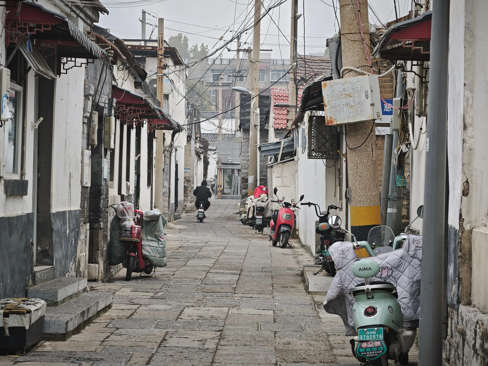
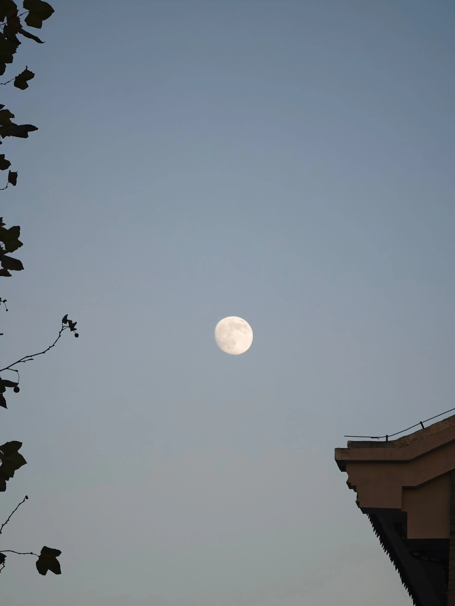
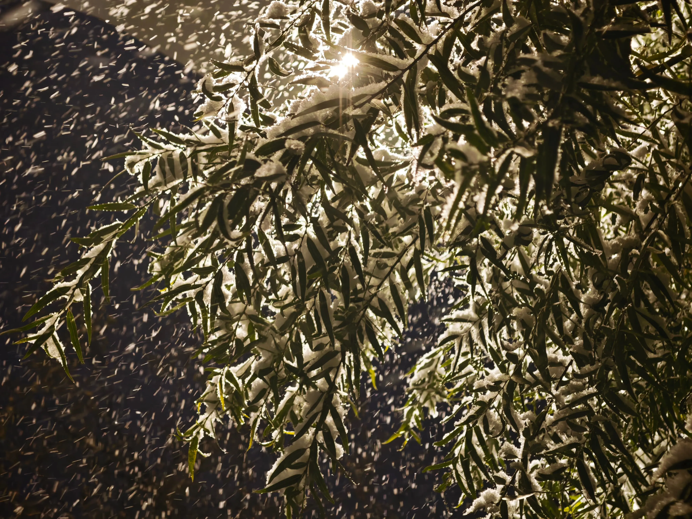

import WidgetBilibiliPlayer from '@components/notebook/widget/WidgetBilibiliPlayer.astro'

# 我的 2025

又到一年最后一天，再次翻翻相册，回顾这一年，想做的好多事一如既往的没做完，只能明年再继续了。不过也完成了几个有意义的事情。

今年记下了很多想法，再回看，觉得最有感触的一句还是「学习如何去爱」。如何去热爱、爱别人、爱自己。

不得不说，今年还是拍了几张自己觉得还可以的照片，比如下面这张，虽然没有专业设备，也不会啥拍摄技巧，但就只是记录一下生活，也是在这里留下回忆。

今年的年度总结，总算是看起来正经一些了，选了好几张图片，也说了一些自己想说的话，还有很多想说的，还需要在酝酿一下，就放在以后再聊吧。

最后是今年最喜欢的歌，其实有点难选，不过既然是年度总结，还是选一个充满回忆的歌曲吧！一起来听：

<WidgetBilibiliPlayer id="BV1mA4y1R7d3" />
